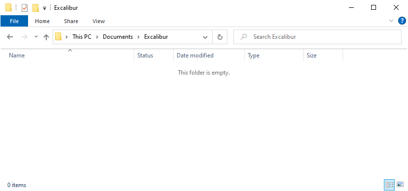
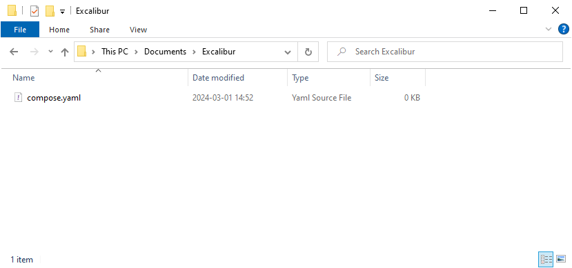
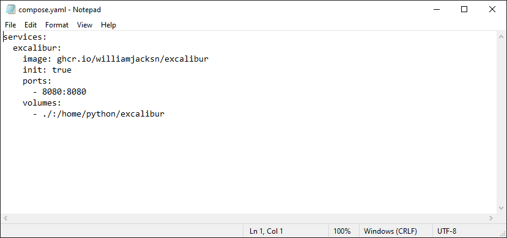
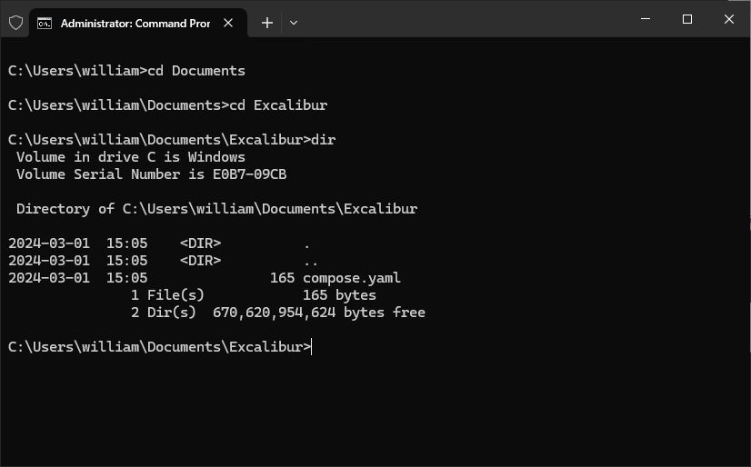

# Running on Windows

1.  Create a new empty folder for this project. In this example, I will create a folder with the name `Excalibur` in my
    `Documents` folder.

    

2.  In the empty `Excalibur` folder, create a file with the name `compose.yaml`.

    

3.  Edit the `compose.yaml` file and enter the following contents. Indentation is important.

    ```
    services:
      excalibur:
        image: ghcr.io/williamjacksn/excalibur
        init: true
        ports:
          - 8080:8080
        volumes:
          - ./:/home/python/excalibur
    ```

    

4.  Open a Command Prompt window and navigate to the `Excalibur` folder that contains the `compose.yaml` file.

    

5.  Run the command `docker compose up excalibur` to start the service.

    If you see an error that mentions &ldquo;Permission denied&rdquo;, verify that you are running the Command Prompt
    window as a normal user. Do not use &ldquo;Run as Administrator&rdquo; to open the Command Prompt window.
 
6.  Open a web browser and navigate to [http://localhost:8080]().
7.  When you are done, go back to the Command Prompt window and press Ctrl+C to stop the service.
